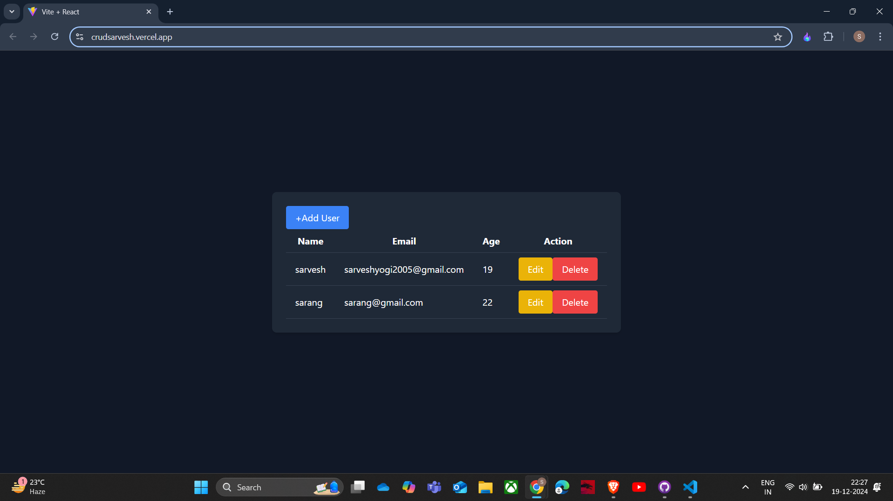
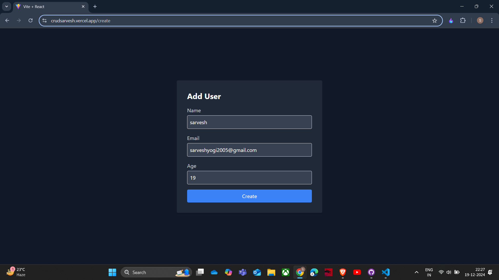

# **CRUD Application**

## **Description**

This **CRUD Application** is a full-stack project that implements Create, Read, Update, and Delete operations. Designed with simplicity and functionality in mind, it provides a seamless interface for managing data efficiently. The project is ideal for learning and demonstrating CRUD functionality using modern web development technologies.

---

## **Demo**

- **Live Demo**: [Project Link](https://crudsarvesh.vercel.app/)

---

## **Features**

- Add new items to the database (Create).
- Display a list of all items (Read).
- Update existing items (Update).
- Delete items from the database (Delete).
- Clean and responsive user interface.

---

## **Installation and Usage**

### **Prerequisites**

- Node.js and npm installed on your system.

### **Setup Instructions**

1. Clone this repository:
   ```bash
   git clone https://github.com/SARVESHYOGI/crud.git
   ```
2. Navigate to the client directory:

   ```bash
   cd client

   ```

3. Install dependencies in client:
   ```bash
   npm install
   ```
4. Navigate to the server directory:

   ```bash
   cd server

   ```

5. Install dependencies in server:

   ```bash
   npm install
   ```

6. Start the both development server:
   ```bash
   npm run dev
   ```
7. Open your browser and navigate to `http://localhost:3000/` and `http://localhost:5173/`.

---

## **Technologies Used**

- **Frontend**: React.js
- **Backend**: Node.js, Express.js
- **Database**: MongoDB
- **Styling**: CSS/Tailwind CSS

---

## **How It Works**

1. The user interacts with the frontend to perform CRUD operations.
2. Data is sent to the backend, where appropriate actions are performed.
3. The database stores and retrieves data for Create, Read, Update, and Delete requests.

---

## **Screenshots**

Example:  



---

## **Contributing**

Contributions are welcome! Please fork this repository and submit a pull request with your changes.

---
